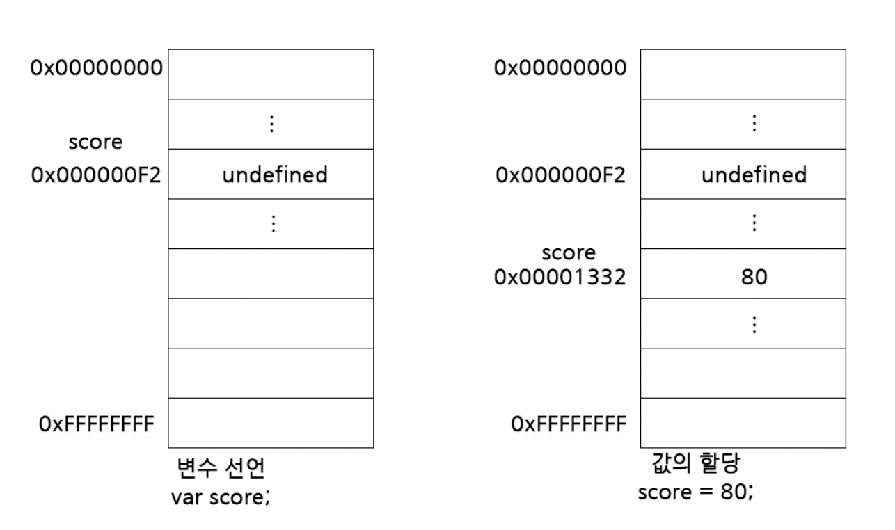

### Assignment

```javascript
var score;
score = 80;

var score = 80;
```

The JavaScript engine executes a two-step progress: the first step is Declaration, and the second is Assignment
even though it appears as only one sentence.

the timing of variable declaration and Assignment differs. 
variable declarations are progressed before runtime, whereas value assignments occur during runtime.

> also you could see [here](variable-declaration.md)

Please see the Image below.

