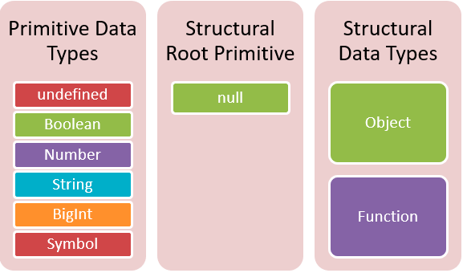

### data type

> A data type signify the category of value. In JavaScript, every value has a data type. 
> 
> Additionally, there are seven data types in JavaScript.




#### Type Number

Although there are many numerical data types such as float and double in language like C or Java,
JavaScript has only one numerical data type called "Number".

#### Type String

the string type is used for text data. 
it is typically enclosed single quotation marks, double quotation marks, or bacticks.

#### Type Undefined

the undefined type has only one value, it is "undefined".
Typically, "undefined" is used by JavaScript engine for initialization and is not used intentionally by developers. 

#### Type null

the null type has only one value, it is "null".
In programming languages, "null" is used intentionally to specify that a value is empty or has no value. 

#### Type Symbol

the symbol type, introduced in es6, is an immutable primitive value. 
Since it can't have the same value as other values,
it is used to create object property keys without the risk of conflict.

A Symbol is created using the Symbol function.
the value generated during this process is not exposed externally and is guaranteed to be unique,
ensuring it never overlaps with others.

```javascript

var key = Symbol('key');
```

#### Type Object

In JavaScript, All data types are categorized into Primitive types and Object types.
As JavaScript is an object-based language, all types are considered object types, except for the six primitive types we have just seen.
