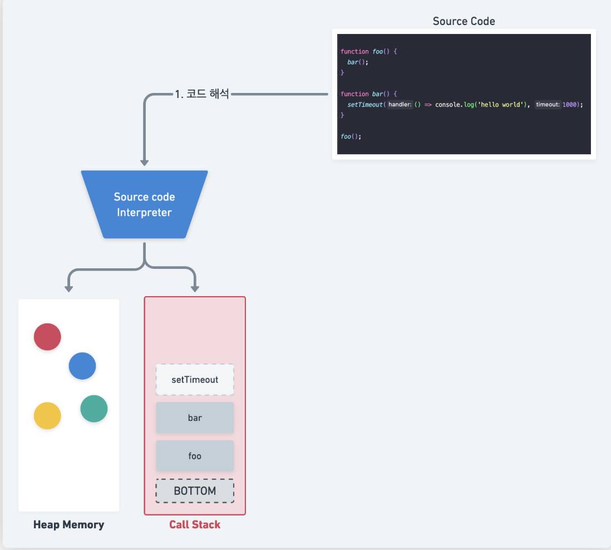

# browser VS node.js

- 브라우저 환경의 자바스크립트는 파일 시스템을 제공하지 않는다.
- 브라우저 DOM, BOM 클라이언트 사이드 Web API 제공

- Node.js
  : 크롬 V8 엔진으로 빌드된 자바스크립트 런타임 환경

# 1) 런타임이란

: 자바스크립트 런타임(JavaScript runtime)은 자바스크립트 코드가 실행되는 환경을 의미

## 런타임 기본 4요소

- Javascript Engine : Call Stack , Heap Memory
- Background : 비동기 task 를 수행하는 Multi Threads (Timer, eventListener ...)
  - Background 작업을 마치면, API가 호출될 때 전달받은 callback(Task) 을 Task Queue 에 삽입하기 위해 Event Loop 에게 전달
- 여러 Task Queue : Background 작업 수행 후 Callback 을 관리
- Event Loop : Single Thread, Non-blocking IO 의 책임
  - Event Loop 는 Javascript Runtime 의 중심에서 Call Stack 과 Background 간의 업무 처리를 돕는 중개자 역할을 한다. 무한 루프를 돌면서 Callback(Task) 를 Background 에서 Task Queue 로, Task Queue 에서 Engine 의 Call stack 으로 적절히 전달한다.

### Javascript Engine

Node Js 나 브라우저와 같은 Javascript Runtime 에 포함되어있는 Javascript Engine 은 코드를 읽는 Interpreter, 코드를 바탕으로 현재 실행중인 서브루틴을 관리하는 Call Stack, 그리고 변수와 객체에 대한 메모리 할당 및 관리를 담당하는 Heap Memory 로 구성

자바스크립트 엔진은 은 .js파일을 읽으면서 Call stack 을 채우고, Call stack 에 있는 작업들을 수행하기를 반복

## Node의 런타임 환경

Node.js 런타임 환경은 크게 두 부분으로 구성됩니다:

- V8 엔진: JavaScript 코드를 실행하고 해석합니다. 간단한 수학 연산(1 + 1) 같은 작업을 처리합니다.
- Libuv: V8이 처리하지 못하는 파일 읽기, 네트워크 요청 같은 작업을 담당하는 다중 플랫폼 비동기 I/O 라이브러리입니다.
  (기타)
- Node API: Node.js가 제공하는 기본 내장 API들입니다. 파일 시스템 접근(fs), 네트워크(net), 프로세스 관리(process) 등 운영체제 수준의 기능들을 자바스크립트에서 사용할 수 있게 래핑(wrapping)해줍니다.

## FLOW

1. 사용자 자바스크립트 코드가 V8 엔진에서 실행됩니다.
2. 네트워크 요청, 파일 읽기 등 비동기 작업이 필요하면, Node API를 통해 libuv에 작업을 위임합니다.
3. libuv는 이벤트 루프를 돌면서 비동기 작업이 완료되면 적절한 콜백을 V8 엔진에 넘겨 실행하도록 합니다.
   - Event Loop: 여러 이벤트가 동시에 발생했을 때 어떤 순서로 콜백함수를 호출할지를 판단

### 브라우저의 런타임 환경

- 브라우저의 런타임 = 자바스크립트 엔진 + 브라우저 API + 이벤트 루프 등
- Node.js 런타임 = 자바스크립트 엔진 + Node.js API + 이벤트 루프 등

# 2) v8엔진이란?

: 자바스크립트는 인터프리터 언어기 때문에 코드를 해석하고 실행하는 엔진이 필요하다.
V8은 Google Chrome을 구동하는 JavaScript 엔진의 이름이다. 자바스크립트를 해석하고 컴파일하여 기계어로 변환한다.
V8은 C++로 작성되었으며 모든 C++ 애플리케이션에서 내장할 수 있다.

- 웹어셈블리(WebAssenbly) 엔진이다.
- 크롬 웹 브라우저와 NodeJs에서 사용되고 있다.
- V8은 JavaScript를 바이트코드로 컴파일하고 실행하는 방식을 사용한다.

JavaScript 엔진이 호스팅되는 브라우저에 독립적인 기능 덕분에 Node.js가 부상할 수 있었다.

## V8 메모리 구조

JavaScript V8엔진 소스안에는 하나의 힙과 하나의 콜 스택만이 있다.

자바스크립트가 단일 스레드이기 때문에 V8은 자바스크립트 컨텍스트 당 한 개의 프로세스를 사용한다.

실행 중인 프로그램은 V8 프로세스에서 할당된 일정량의 메모리로 표현되고 이를 Resident Set이라고 한다. Resident Set은 아래와 같이 더 세부적으로 나누어진다.

### 힙 메모리

: V8 엔진은 힙 메모리에 객체나 동적 데이터를 저장한다. 힙 메모리는 메모리 영역에서 가장 큰 블록이면서 가비지 컬렉션(GC)이 발생하는 곳이다.

힙 메모리 전체에서 가비지 컬렉션이 실행되는 것은 아니다. Young과 Old 영역에서만 실행된다.

- New 영역: New 영역 또는 "Young 제너레이션"은 새로 만들어진 모든 객체를 저장하고 이 객체들은 짧은 생명 주기를 가진다.
- Old 영역: Old 영역 또는 "Old 제너레이션"은 마이너 GC가 두 번 발생할 동안 "New 영역"에서 살아남은 객체들이 이동하는 영역이다.

- 라지 오브젝트 영역: 다른 영역의 제한된 크기보다 큰 객체들이 살고 있는 영역이다. 각 객체는 자체 mmap 메모리 영역을 갖는다. 라지 오브젝트들은 가비지 컬렉터로 이동하지 않는다.
- 코드 영역: 실시간(JIT) 컴파일러가 컴파일된 코드들을 저장하는 곳이다. 유일하게 실행 가능한 메모리가 있는 영역이다. (코드들은 "라지 오브젝트 영역"에 할당될 수도 있고 실행도 가능하다)
- 셀 영역, 속성 셀 영역, 맵 영역: 이 영역들은 각각 Cells, PropertyCells, Maps을 포함한다. 각 영역은 모두 같은 크기의 객체들을 포함하며, 어떤 종류의 객체를 참조하는지에 대한 제약이 있어서 수집을 단순하게 만든다.

### 스택

: 스택은 메모리 영역이고 V8 프로세스마다 하나의 스택을 가진다. 스택은 메서드와 함수 프레임, 원시 값, 객체 포인터를 포함한 정적 데이터가 저장되는 곳이다.
