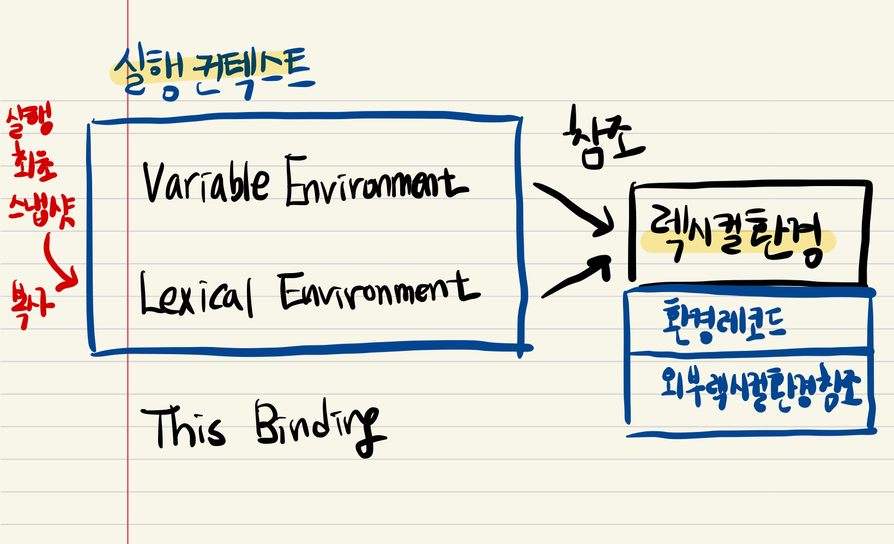

## 실행 컨텍스트 (Execution Context)

> [호이스팅](hoisting), [this](this) 에 대한 내용이 연관되어 있습니다.

### 정의

실행 컨텍스트는 실행할 코드에 제공할 환경 정보들을 모아놓은 객체이다.  
이 컨텍스트를 콜 스텍(call stack)에 쌓아, 가장 위의 컨텍스트와 관련 있는 코드들을 실행하는 형식으로 전체 코드의 환경과 순서를 보장한다.

### 종류

하나의 실행 컨텍스트를 구성할 수 있는 방법은 다음과 같다.

1. 전역공간
2. eval() 함수
3. 함수 실행

엔진이 스크립트 파일을 실행하기 전에 글로벌 실행 컨텍스트(Global Execution Context, GEC) 가 생성되고,
함수를 호출할 때마다 함수 실행 컨텍스트(Function Execution Context, FEC) 가 생성된다. 주의할 점은, 글로벌의 경우 실행 이전에 생성되지만 함수의 경우 호출할 때 생성된다는 점이다.
