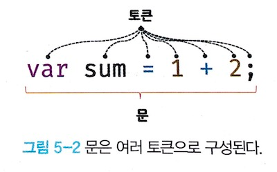

### expression
> An expression is a type of statement that can be evaluated to produce a value.
> 
> This means an expression can either generate new value or refer to an existing value.

the following are examples of expression in JavaScript.

```javascript
var score = 100;
var score2 = 50 + 50;
score; // 100
```

### statement
> A statement is the smallest independent unit that make up a program.
> 
> Furthermore, a statement is composed of tokens, which are the fundamental elements with grammatical meaning that cannot be further divided.

