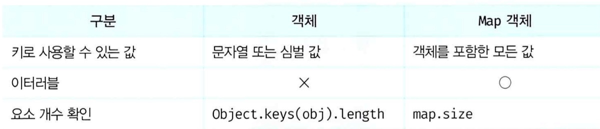

## map

> A map object is a collection consisting of key-value pairs. 

Map object is similar to an object, but there are some differences as outlined below.


### generating a map object

Map object can create a generator function of Map.

```javascript
const map = new Map();
console.log(map) // Map(0)
```

