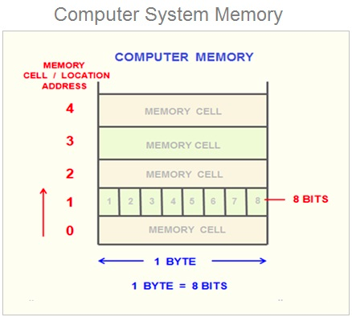

### Variable

> In this chapter, you need to understand the concepts of  
> [literal](), [operator]() and [expression]().

### 1. What is the Variable?
> A variable is a location in memory where a value is stored.

Now, let's explore how a computer calculates values.

A computer uses the **CPU** for calculations and stores data in **memory**.

the memory is a set of memory cells, with each cell having a size of 1-byte(8-bit).

Therefore, a computer writes or saves data in 1-byte increments. 

Each of the memory cells has its own unique memory address composed of binary numbers.

```javascript
console.log(10+20)
```
The computer save the numbers (10 and 20) in specific memory addresses. The CPU later reads these numbers from their respective memory addresses and performs calculations.

However, the CPU doesn't save the result value of 30. 
In JavaScript, individual memory management is not directly controlled.

Therefore, Programming languages use variables to save the location of memory. 
This allows developers to access values through the variables.



> assignment is "대입" in korean, which means saving values in variables.
> 
> reference is "참조" in korean, which means reading values from variables.


### Identifier
> The name of variable is called an Identifier.
> An identifier can also refer to a function, a class, or other entities.

It can identify a value using an identifier.