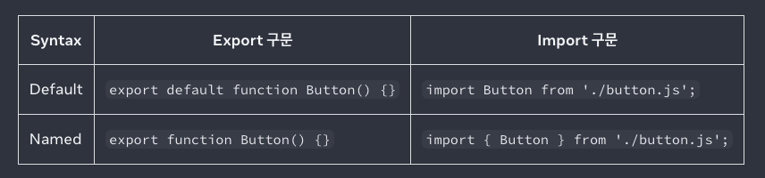

# import and export



문제 1) 다음은 가능한 코드일까요?

```
export default function Button() {}
import Banana from './button.js'

// 갤러리가 디폴트, 프로파일이 네임드

import Gallery, { Profile } from './Gallery.js';

export default function App() {
  return (
    <Profile />
  );
}
```

# React 렌더링 로직과 JSX 정리

## 1. 렌더링 로직과 마크업의 결합 (React 철학)

- **배경**: 웹이 점점 더 **인터랙티브**해지면서 UI가 단순히
  마크업(HTML)으로 고정되는 게 아니라, **로직이 내용을 결정**하는
  경우가 많아졌음.\
- **결과**: JavaScript가 HTML을 직접 생성/관리하게 되었고, React는 이
  개념을 체계화하여 **렌더링 로직과 마크업을 같은 위치에서
  작성**하도록 설계됨.

---

## 2. Fragment와 렌더링 구조

- **Fragment 역할**: 여러 엘리먼트를 그룹화하지만, 실제 DOM에는 남지
  않음.

  ```jsx
  <Fragment key={yourKey}>...</Fragment>
  ```

  → DOM 결과에는 영향 없음.

- **DOM vs React Virtual DOM**

  - 브라우저 DOM: `<><><Counter /></></>` 와 `<Counter />`는
    동일하게 `<div>Counter</div>`처럼 결과 동일.\
  - React Virtual DOM(fiber tree): Fragment도 **FiberNode(type:
    Fragment)** 로 기록됨. 즉, React는 Fragment를 노드로 인식하고
    state 보존 여부 판단에 사용.

---

## 3. State 보존/초기화 규칙

- React는 DOM 결과물이 아니라 **가상 Fiber 트리 구조**를 기준으로
  state를 보존/초기화함.
- **규칙**: _한 단계 깊이까지만 Fragment 유무 차이를 무시_.
  - 더 깊어지면 React 입장에서는 다른 구조로 판단 → state 초기화.

### 예시 1: Fragment ↔ Fragment (state 보존됨)

```jsx
return isFancy ? (
  <>
    <Counter isFancy={true} />
  </>
) : (
  <>
    <Counter isFancy={false} />
  </>
);
```

→ 같은 깊이의 Fragment끼리 교체이므로 Counter의 state 보존.

### 예시 2: 이중 Fragment ↔ 단일 컴포넌트 (state 초기화됨)

```jsx
return isFancy ? (
  <Counter isFancy={true} />
) : (
  <>
    <>
      <Counter isFancy={false} />
    </>
  </>
);
```

→ 구조가 달라졌다고 판단 → state 초기화.

---

## 4. JSX의 본질

- **JSX는 표현식(expression)** 이다.
  - 표현식: 값으로 평가될 수 있는 구문.\
  - 문(statement): 프로그램의 최소 실행 단위 (조건문, 반복문 등).\
  - 따라서 JSX 내부에는 **표현식만 가능**하고, statement는 직접 실행
    불가.

```jsx
const MyComponent = () => {
  const a = 1;
  const b = 2;

  return <Box>표현식입니다: {a > b ? 3 : null}</Box>;
};
```

---

## 5. React의 핵심 가치관

- **JS가 UI를 결정한다**: HTML은 JS가 결정한 결과물.\
- **표현식 기반 선언형 UI**: JSX는 UI를 값처럼 다룰 수 있게 해줌.\
- **Transpiler 필요**: JSX는 브라우저가 직접 이해하지 못하므로 Babel
  같은 도구가 필요.
